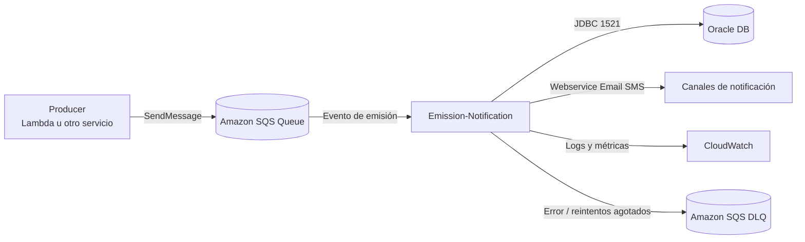
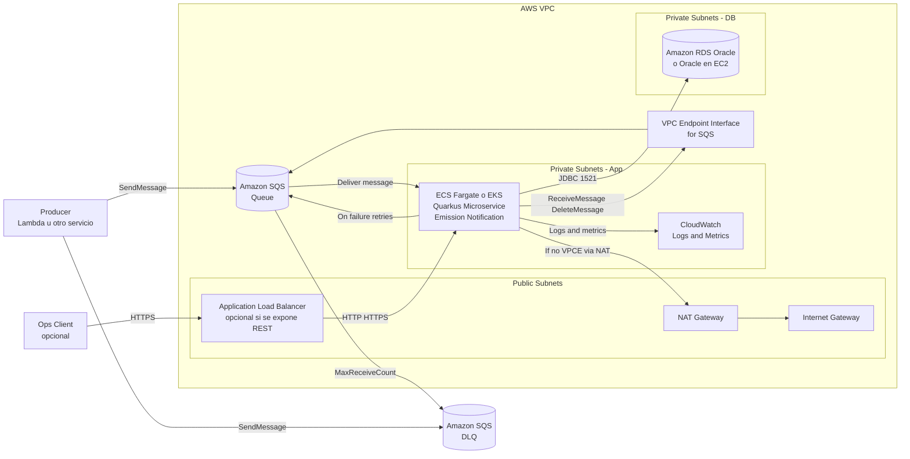
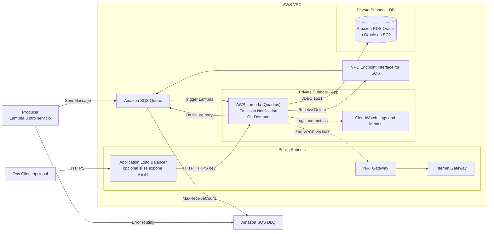

<!-- PROJECT LOGO -->
<br />
<div align="center">
  <a href="">
    
  </a>

[//]: # (  [![Commits][commits-shield]][commits-url])

<h2 align="center">Emission notification</h2>
  <p align="center">
    Servicio de notificación de emisiones de pólizas. Expone un caso de uso para enviar notificaciones por diferentes canales y persiste el registro de la notificación.
  </p>
</div>


## 📌 Tabla de Contenidos

---

- [📖 Sobre el proyecto](#-sobre-el-proyecto)
- [🚀 Tecnologías](#-tecnologías)
- [🏗 Arquitectura y patrones](#-arquitectura-y-patrones)
- [☁️ Diagramas de arquitectura](#-diagramas-de-arquitectura)
- [🧱 Estructura del proyecto](#-estructura-del-proyecto)
- [🏇 Cómo correr el proyecto](#-cómo-correr-el-proyecto)

## 📖 Sobre el Proyecto

---
**Emission-notification** es un microservicio encargado de enviar notificaciones relacionadas con emisiones de pólizas.

Permite:

- Enviar notificaciones por distintos canales (webservice, email, sms)
- Persistir el historial de notificaciones emitidas
- Aplicar reglas de dominio con validaciones internas

## 🚀 Tecnologías

---
Este proyecto está construido con:

* [![Java][Java-shield]][Java-url]
* [![Quarkus][Quarkus-shield]][Quarkus-url]
* [![AWS SQS][AWS-SQS-shield]][AWS-SQS-url]
* [![Maven][Maven-shield]][Maven-url]
* [![Hibernate][Hibernate-shield]][Hibernate-url]
* [![Jakarta Validation][Jakarta-shield]][Jakarta-url]
* [![Oracle JDBC][Oracle-shield]][Oracle-url]


## 🏗 Arquitectura y patrones

---
El servicio sigue una arquitectura limpia basada en principios modernos:

- **Arquitectura Hexagonal**  
  Separación clara entre dominio, aplicación e infraestructura.

- **Tell, Don't Ask**  
  El dominio valida su propio estado.

- **Abstract Factory (Infraestructura)**  
  Selección desacoplada del canal de envío:

    - Webservice
    - Email
    - SMS

## ☁️ Diagramas de arquitectura

---
### Diagrama lógico (común)



### Despliegue 1: Emission-Notification como microservicio (ECS/EKS)


### Despliegue 2: Emission-Notification como servicio on-demand Lambda


## 🧱 Estructura del Proyecto

---
``` bash
src/main/java/org/microservices/notification_emission
├── application
│   ├── qualifier
│   │   └── ChannelAdapter.java
│   └── servcice
│       ├── SendEmissionNotificationService.java
│       ├── SendEmissionNotificationUseCase.java
│       └── dto
│           ├── SendEmissionNotificationRequest.java
│           ├── SendEmissionNotificationResponse.java
│           └── data
│               ├── EmissionDto.java
│               ├── ShippingChannel.java
│               └── VehicleRegistrationDto.java
├── domain
│   ├── model
│   │   ├── Emission.java
│   │   ├── EmissionNotification.java
│   │   ├── VehicleRegistration.java
│   │   └── vo
│   │       ├── Plaque.java
│   │       ├── ShippingChannel.java
│   │       └── StatusNotification.java
│   ├── ports
│   │   ├── channel
│   │   │   └── ChannelNotificationSender.java
│   │   ├── dao
│   │   └── repository
│   │       ├── EmissionRepository.java
│   │       └── NotificationEmissionRepository.java
│   └── service
│       └── NotificationEmissionDomainService.java
└── infrastructure
    ├── configuration
    ├── exeptions
    ├── input
    │   ├── rest
    │   │   └── EmissionNotificationController.java
    │   └── sqs
    └── output
        ├── channel
        │   ├── ChannelNotificationAdapter.java
        │   ├── factory
        │   │   ├── ChannelFactoryProvider.java
        │   │   ├── ChannelNotificationSenderAbstractFactory.java
        │   │   ├── EmailFactory.java
        │   │   ├── SmsFactory.java
        │   │   └── WsFactory.java
        │   └── impl
        │       ├── EmailChannelNotificationSender.java
        │       ├── SmsChannelNotificationSender.java
        │       └── WsChannelNotificationSender.java
        └── database
            └── oracle
                ├── EmissionOracleAdapter.java
                ├── NotificationEmissionOracleAdapter.java
                └── Entity
                    └── NotificationEmissionEntity.java
```

## 🏇 Cómo correr el Proyecto

---
### 🔥 Modo desarrollo

```bash
./mvnw quarkus:dev
```

### 📦 Empaquetar

```bash
./mvnw package
```

### ▶ Ejecutar el JAR

```bash
java -jar target/quarkus-app/quarkus-run.jar
```

### ✅ Tests

```bash
./mvnw test
```

### 📨 Probar flujo SQS (producer + consumer)

Con el servicio arriba, podés publicar mensajes en la cola con:

```bash
curl -X POST http://localhost:8030/sqs/messages \
  -H "Content-Type: application/json" \
  -d '{
    "emissionId": 10,
    "shippingChannel": "EMAIL",
    "vehicleRegistration": {
      "plaque": "ABC123",
      "isIssued": true,
      "police": "12345"
    }
  }'
```

El consumidor ejecuta polling automaticamente y procesa los mensajes recibidos sin necesidad de invocar un endpoint de lectura.

---
<!-- MARKDOWN LINKS & IMAGES -->
<!-- https://www.markdownguide.org/basic-syntax/#reference-style-links -->
<!-- https://simpleicons.org/ -->
[Java-shield]: https://img.shields.io/badge/Java-ED8B00?style=for-the-badge&logo=openjdk&logoColor=white
[Java-url]: https://www.java.com/
[Quarkus-shield]: https://img.shields.io/badge/Quarkus-ffbb00?style=for-the-badge&logo=quarkus&logoColor=white
[Quarkus-url]: https://quarkus.io/
[AWS-SQS-shield]: https://img.shields.io/badge/AWS_SQS-FF9900?style=for-the-badge&logo=amazonsqs&logoColor=white
[AWS-SQS-url]: https://aws.amazon.com/sqs/
[Maven-shield]: https://img.shields.io/badge/Apache_Maven-C71A36?style=for-the-badge&logo=apachemaven&logoColor=white
[Maven-url]: https://maven.apache.org/
[Hibernate-shield]: https://img.shields.io/badge/Hibernate-59666C?style=for-the-badge&logo=hibernate&logoColor=white
[Hibernate-url]: https://hibernate.org/
[Jakarta-shield]: https://img.shields.io/badge/Jakarta_EE-004088?style=for-the-badge&logo=jakartaee&logoColor=white
[Jakarta-url]: https://jakarta.ee/
[Oracle-shield]: https://img.shields.io/badge/Oracle-F80000?style=for-the-badge&logo=oracle&logoColor=white
[Oracle-url]: https://www.oracle.com/database/
[commits-shield]: https://img.shields.io/github/commit-activity/t/solano2020/emission-notification?style=for-the-badge&logo=github
[commits-url]: https://github.com/solano2020/emission-notification/graphs/commit-activity
